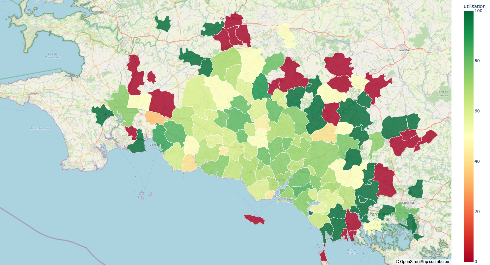
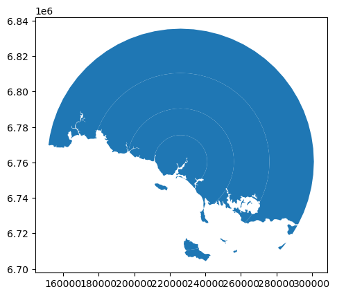
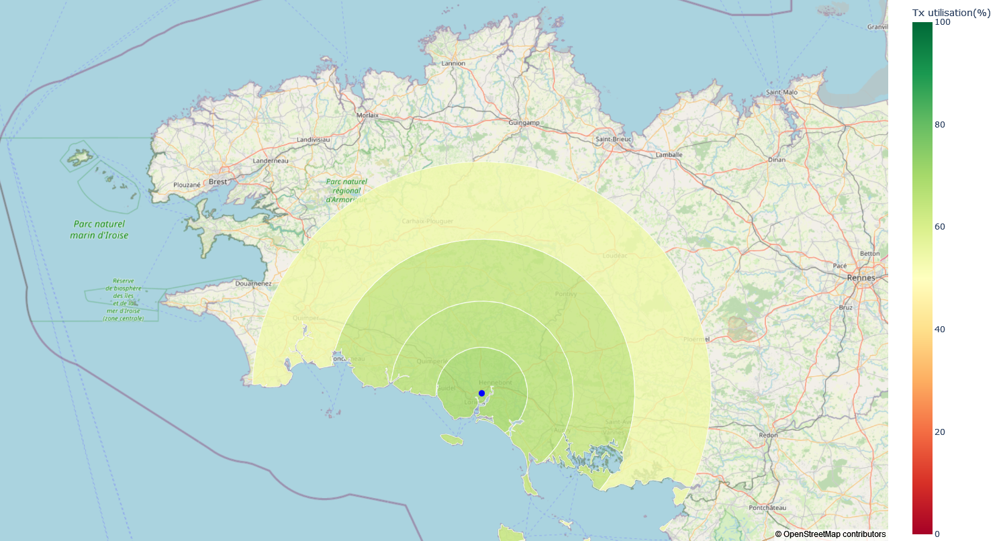

# Geographic Analysis of "Bon chaussures" project

In 2022, we started a project at GHBS (GROUPE HOSPITALIER BRETAGNE SUD) to provide better professional shoes to health staff.
We contracted a partnership with a sport shop to provide running shoes. 
Recent medical studies show that running shoes are adapted to health staff for the long distance they walk during a shift.
They also procure a good cushioning in the heel to prevent knee and lower back pains.

Each health staff were given a voucher to buy a pair of running shoes. 
The voucher is enough to buy a good pair of running shoes without a personal financial contribution.
We let the liberty to add money to buy a pair with superior quality if they wanted.

We constated at the end of the year 2022 that one third of health staff did not used their voucher.
We tried to understand the reasons and decided to analyze if the distance between the home address of health staff and the sport shop had an impact on the voucher use.

The principal libraries for this project are Geopandas and Plotly. 

The first step was to get GPS location and city code from health staff's home addresses and the sport shop. 
The API from the BAN (Base d'adresse nationale) was used to retrieve all GPS locations and city codes. 
Geocoding.py file shows the function to make the request to the API. 
A CSV file containing all address is send to the API for geocoding and the latitude, longitude and city code are received back.

Two maps were created with Plotly.

A choropleth map with the voucher use ratio by city where health staff lives (Analyse_geo_commune.py).
Data is grouped by city and a use ratio is calculated.
The data is joined with a geojson file containing the geometry of all the cities areas.
The choropleth map is then plotted with the color scale for the use ratio.

The second map shows the use ratio of the voucher base on the distance from the sport shop (Analyse_geo_distance.py).
A new layer is created based on the sport shop location. Four circular area are drawn to represent the distance from the sport shop.
The shape of the coast was removed with an overlay function between the circular layer and France layer.

A geo join is made between all home's staff locations and the new layer.
a group by is then used to calculate the use ratio for each circular area.

Finally, the map is plotted with plotly.

We concluded that the geographical factor had a moderate impact on the voucher's use.
The project was a good practice to use Geopandas and Plotly with GIS data.

