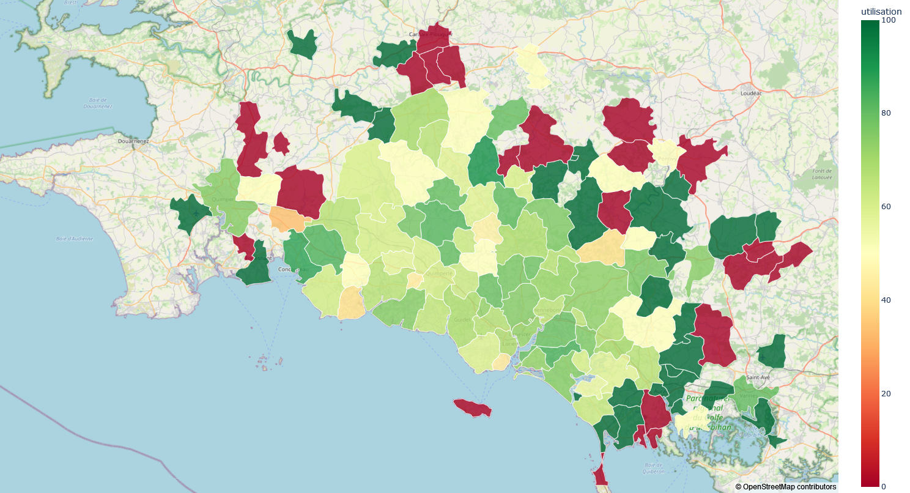
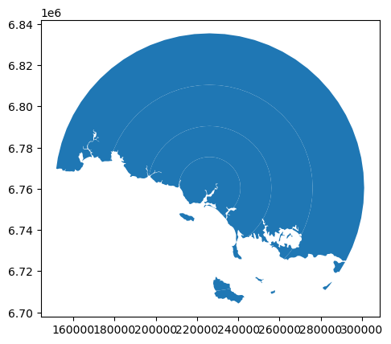
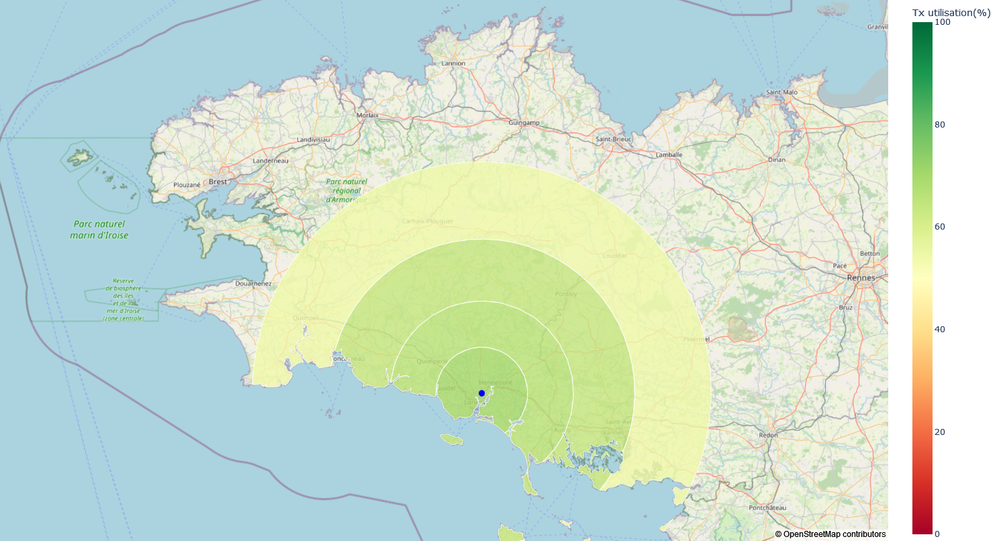

# Geographic Analysis of "Bon chaussures" project

In 2022, GHBS (Groupe Hospitalier Bretagne Sud) launched an initiative to improve the comfort and well-being of our healthcare staff by providing superior professional footwear. Recognizing the physical demands of their roles, we formed a strategic partnership with a reputable sports retailer to supply running shoes. Recent medical research highlights that running shoes are particularly suited for healthcare workers due to the extensive distances they walk during shifts. These shoes offer enhanced cushioning, especially in the heel area, effectively reducing the risk of knee and lower back pain, and promoting overall comfort and injury prevention.

Each health staff were given a voucher to buy a pair of running shoes. 
The voucher is enough to buy a good pair of running shoes without a personal financial contribution.
We let the liberty to add money to buy a pair with superior quality if they wanted.

At the end of 2022, one third of health staff did not used their voucher.
We tried to understand the reasons and decided to analyze if the distance between their home addresses and the sport shop influenced voucher usage.

The principal libraries used for this project are Geopandas and Plotly. 

The first step was to get the GPS location and city code from health staff's home addresses and the sport shop. 
The API from the BAN (Base d'adresse nationale) was used to retrieve all GPS locations and city codes. 
Geocoding.py file shows the function to request the API. 
A CSV file containing all address is send to the API for geocoding and the latitude, longitude and city code are received back.

Two maps were created with Plotly.

A choropleth map with the voucher usage ratio by city where health staff lives (Analyse_geo_commune.py).
Data is grouped by city and a usage ratio is calculated.
The data is joined with a geojson file containing the geometry of all the cities areas.
The choropleth map is then plotted with the color scale representing the voucher usage ratio, providing a clear visual analysis of the data.

The second map visualizes the voucher usage ratio based on the distance from the sports store (Analyse_geo_distance.py).   
A new layer was generated using the location of the store as a central point, with four concentric circles representing different distance intervals.   
To ensure accurate representation, the coastline was excluded using an overlay function that clipped the circular layers with the geographic boundaries of France

A geo join is made between all home's staff locations and the new layer.
The data is then aggregate to calculate the usage ratio for each circular area.

Finally, the map is plotted with plotly.

Our analysis concluded that geographical factors had a moderate impact on voucher usage. 
Further investigation revealed that the key to improving participation was better communication, including regular reminders to healthcare staff about redeeming their vouchers. 
Overall, this project provided valuable experience in utilizing Geopandas and Plotly for working with GIS data and conducting spatial analysis.

